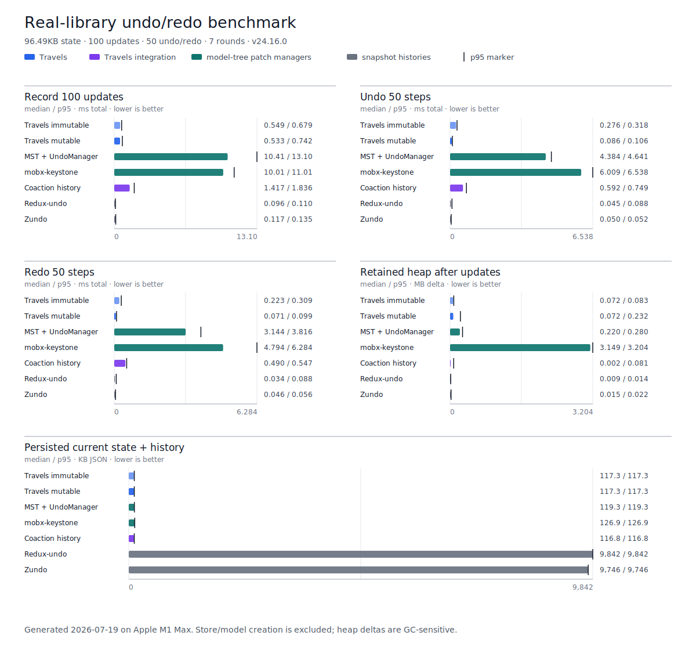

# Travels Performance & Memory Benchmarks

This directory contains reproducible benchmarks for Travels history recording,
navigation, persistence, and validation. It includes both algorithm-level
scenarios and comparisons against real undo/redo libraries.

## Real-library comparison

`real-library-benchmark.js` runs the same deterministic workload through seven
real configurations:

| Configuration                  | History representation | State semantics            |
| ------------------------------ | ---------------------- | -------------------------- |
| Travels immutable              | JSON Patch             | Generic immutable root     |
| Travels mutable                | JSON Patch             | Generic in-place root      |
| MST + `UndoManager`            | JSON Patch             | MobX-State-Tree model tree |
| mobx-keystone                  | Array-path patches     | mobx-keystone model tree   |
| Coaction + `@coaction/history` | Travels JSON Patch     | Coaction store             |
| Redux-undo                     | Snapshots              | Immutable root             |
| Zundo                          | Snapshots              | Immutable root             |

MST's patch-based `UndoManager` is imported from the community companion
`mst-middlewares` package. mobx-keystone uses its built-in `undoMiddleware`, and
Coaction uses `@coaction/history` with its patch-native Travels timeline.

### Run

From the repository root:

```bash
pnpm --dir benchmarks install --frozen-lockfile
pnpm benchmark:real
```

To benchmark an unreleased local Coaction checkout, build its two packages and
pass the checkout explicitly. The runner maps that history package to the
current Travels build without changing either repository's dependency links:

```bash
pnpm --dir /path/to/coaction --filter coaction build
pnpm --dir /path/to/coaction --filter @coaction/history build
pnpm --dir benchmarks run test:real -- --coaction-repo=/path/to/coaction
```

The JSON report records the local Git revision and whether its worktree was
dirty. Without `--coaction-repo`, the installed npm packages are measured.

The default run builds the current Travels checkout, warms every adapter, and
then performs seven interleaved measurement rounds. It writes:

- `benchmarks/results/real-library-benchmark.json`: configuration, environment,
  package versions, every sample, and median/p95 summaries.
- `benchmarks/results/real-library-benchmark.svg`: a directly labeled chart of
  the main latency and footprint metrics.

For a fast validation run that does not replace the checked-in results:

```bash
pnpm --dir benchmarks run test:real:quick
```

You can also override the default workload:

```bash
pnpm --dir benchmarks run test:real -- \
  --state-size-kb=200 \
  --iterations=200 \
  --navigation-steps=50 \
  --rounds=9
```

Regenerate only the SVG from the existing JSON data with:

```bash
pnpm --dir benchmarks run chart:real
```

### Methodology

The default workload uses:

- A deterministic, nested document of approximately 100KB.
- 100 history entries, each changing the same two root fields.
- 50 consecutive undo operations followed by 50 redo operations.
- One warmup pass and seven interleaved measurement rounds.
- Production builds with explicit garbage collection before retained-heap
  readings.
- Median and p95 reporting; lower is better for every metric.

Every adapter must finish with the expected state and exactly one history entry
per update. The benchmark also checks that Travels mutable mode preserves the
original root reference.

Store/model construction is excluded from timing and retained-heap deltas. This
keeps the comparison focused on an already-running editor, but it means the
chart does not measure schema creation, initial observability conversion,
rendering, reactions, or framework integration. The persisted-size metric
always includes the current state plus reachable undo/redo history. Stringify
and parse timings measure JSON work after each library has exposed its
persistence payload; they are not full restore timings.

### Latest generated chart



Use the adjacent JSON file for exact values and environment metadata. Absolute
latency and heap values vary by machine; the representation-size comparison is
usually more stable.

## Scenario matrix

`matrix-benchmark.js` compares a full-snapshot history stack with Travels across
state sizes and update shapes. It isolates the algorithmic trade-off without
Redux, MobX, or other integration overhead.

| Dimension           | Default matrix                                                              | Full matrix           |
| ------------------- | --------------------------------------------------------------------------- | --------------------- |
| State sizes         | 10KB, 100KB, 1MB                                                            | 10KB, 100KB, 1MB, 5MB |
| Update types        | Small patch, large patch, array insert/delete, deep object, Map/Set runtime | Same                  |
| Rounds              | 5                                                                           | 7                     |
| Reported statistics | Median, p95                                                                 | Median, p95           |

Run it from the repository root:

```bash
# Default matrix
pnpm run benchmark:matrix

# Full matrix
pnpm run benchmark:full
```

`setState/update (ms)` is the average time per update within a round. The matrix
also includes a focused immutable-vs-mutable primitive hot-path measurement.

## Persistence validation

`persistence-validation-benchmark.js` measures the real default structural and
explicit semantic `Travels.deserialize(...)` paths against a wide-array
history. Unlike a bare `JSON.parse`, semantic validation includes patch replay
and round-trip comparison.

```bash
pnpm run benchmark:persistence
```

## CI benchmark suite

```bash
pnpm run benchmark:ci
```

The CI suite intentionally stays small and runs:

1. A 10KB/100KB scenario matrix with compact-history and mutable-hot-path
   guards.
2. The real structural/semantic persistence-validation guard.

The real-library comparison is not a CI performance gate because shared runners
do not provide stable enough latency or heap measurements.

## Legacy simulator

`memory-performance-test.js` contains simplified Redux-undo, Zundo, and Travels
simulators. It is useful for demonstrating representation differences without
third-party dependencies, but it should not be cited as real-library
performance.

```bash
node --expose-gc benchmarks/memory-performance-test.js
```

## Interpreting metrics

### Retained heap

The benchmark forces GC before and after history recording, then reports the
heap delta. V8 allocation and collection behavior still makes this the noisiest
metric; repeat runs and prefer large differences over small rankings.

### Update and navigation latency

Update time covers the complete loop that records 100 history entries. Undo and
redo cover 50 calls each. Model-tree libraries intentionally include their
runtime protection and patch middleware in these operations.

### Serialized history size

Snapshot histories may share object references efficiently in memory, but JSON
cannot preserve that sharing and repeats the reachable state for each history
entry. Patch histories generally trade more work during updates/navigation for
a smaller durable representation when updates are small relative to the state.

The result is workload-dependent: large replacements reduce the size advantage
of patches, while large states with small edits and long histories amplify it.

## Benchmarking notes

- Use the same Node version, package lockfile, machine power mode, and workload
  when comparing runs.
- Close high-load applications and run multiple times before drawing latency
  conclusions.
- Prefer median/p95 and relative orders of magnitude over a single fastest
  sample.
- `--expose-gc` reduces, but does not remove, heap-measurement noise.
- The commands build and import the current checkout's explicit CommonJS
  artifact, so they cannot silently use a stale `dist` bundle or a registry copy
  of Travels.
